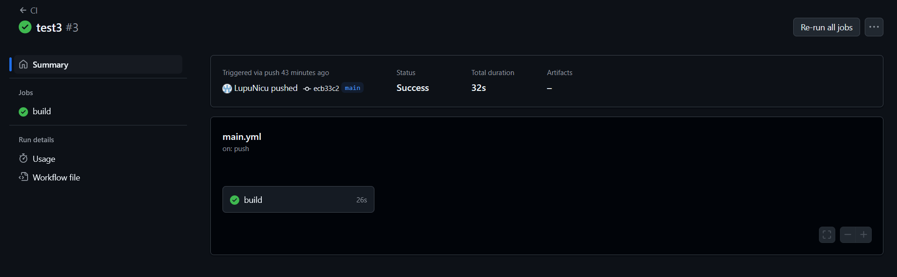

# Lucrare de laborator №8: Integrare continuă cu Github Actions
## Scopul lucrării

În cadrul acestei lucrări studenții vor învăța să configureze integrarea continuă cu ajutorul Github Actions.
## Sarcina

Crearea unei aplicații Web, scrierea testelor pentru aceasta și configurarea integrării continue cu ajutorul Github Actions pe baza containerelor.
## Pregătire

Pentru a efectua această lucrare, trebuie să aveți instalat pe computer Docker.
## Execuție

Creați un repozitoriu containers08 și copiați-l pe computerul dvs.

În directorul containers08 creați directorul ```./site```. În directorul ./site va fi plasată aplicația Web pe baza PHP.
### Crearea aplicației Web

Creați în directorul ```./site``` aplicația Web pe baza PHP cu următoarea structură:

    site
    ├── modules/
    │   ├── database.php
    │   └── page.php
    ├── templates/
    │   └── index.tpl
    ├── styles/
    │   └── style.css
    ├── config.php
    └── index.php

Fișierul ```modules/database.php``` conține clasa Database pentru lucru cu baza de date. Pentru lucru cu baza de date folosiți SQLite. Clasa trebuie să conțină metode:

* __construct($path) - constructorul clasei, primește calea către fișierul bazei de date SQLite; 
* Execute($sql) - execută interogarea SQL;
* Fetch($sql) - execută interogarea SQL și returnează rezultatul sub formă de tablou asociativ;
* Create($table, $data) - creează înregistrare în tabelul $table cu datele din tabloul asociativ $data și returnează identificatorul înregistrării create;
* Read($table, $id) - returnează înregistrarea din tabelul $table după identificatorul $id;
* Update($table, $id, $data) - actualizează înregistrarea în tabelul $table după identificatorul $id cu datele din tabloul asociativ $data;
* Delete($table, $id) - șterge înregistrarea din tabelul $table după identificatorul $id;
* Count($table) - returnează numărul înregistrărilor din tabelul $table.

***Exemplu:***

    <?php

    class Database {
        private $pdo;

        public function __construct($path) {
            $this->pdo = new PDO("sqlite:" . $path);
            $this->pdo->setAttribute(PDO::ATTR_ERRMODE, PDO::ERRMODE_EXCEPTION);
        }

        public function Execute($sql) {
            return $this->pdo->exec($sql);
        }

        public function Fetch($sql) {
            $stmt = $this->pdo->query($sql);
            return $stmt->fetchAll(PDO::FETCH_ASSOC);
        }

        public function Create($table, $data) {
            $columns = implode(", ", array_keys($data));
            $placeholders = implode(", ", array_map(fn($k) => ":$k", array_keys($data)));
            $stmt = $this->pdo->prepare("INSERT INTO $table ($columns) VALUES ($placeholders)");
            $stmt->execute($data);
            return $this->pdo->lastInsertId();
        }

        public function Read($table, $id) {
            $stmt = $this->pdo->prepare("SELECT * FROM $table WHERE id = :id");
            $stmt->execute(['id' => $id]);
            return $stmt->fetch(PDO::FETCH_ASSOC);
        }

        public function Update($table, $id, $data) {
            $fields = implode(", ", array_map(fn($k) => "$k = :$k", array_keys($data)));
            $data['id'] = $id;
            $stmt = $this->pdo->prepare("UPDATE $table SET $fields WHERE id = :id");
            return $stmt->execute($data);
        }

        public function Delete($table, $id) {
            $stmt = $this->pdo->prepare("DELETE FROM $table WHERE id = :id");
            return $stmt->execute(['id' => $id]);
        }

        public function Count($table) {
            $stmt = $this->pdo->query("SELECT COUNT(*) as count FROM $table");
            $result = $stmt->fetch(PDO::FETCH_ASSOC);
            return $result['count'];
        }
    }
    
Fișierul ```modules/page.php``` conține clasa Page pentru lucru cu paginile. Clasa trebuie să conțină metode:

* __construct($template) - constructorul clasei, primește calea către șablonul paginii;
* Render($data) - afișează pagina, înlocuind datele din tabloul asociativ $data în șablon.

***Exemplu:***

    <?php

    class Page {
        private $template;

        public function __construct($template) {
            $this->template = file_get_contents($template);
        }

        public function Render($data) {
            $output = $this->template;
            foreach ($data as $key => $value) {
                $output = str_replace("{{ $key }}", $value, $output);
            }
            return $output;
        }
    }


Fișierul ```templates/index.tpl``` conține șablonul paginii.

***Exemplu:***

    <!DOCTYPE html>
    <html>
    <head>
        <title>{{ title }}</title>
        <link rel="stylesheet" href="/styles/style.css">
    </head>
    <body>
        <h1>{{ title }}</h1>
        <p>{{ content }}</p>
    </body>
    </html>


Fișierul ```styles/style.css``` conține stilurile pentru pagina.

***Exemplu:***

body {
    font-family: Arial, sans-serif;
    margin: 40px;
    background-color: #f5f5f5;
    color: #333;
}

h1 {
    color: #007acc;
}

Fișierul ```index.php``` conține codul pentru afișarea paginii. Un exemplu de cod pentru fișierul ```index.php```:

    <?php

    require_once __DIR__ . '/modules/database.php';
    require_once __DIR__ . '/modules/page.php';
    require_once __DIR__ . '/config.php';

    $db = new Database($config["db"]["path"]);
    $page = new Page(__DIR__ . '/templates/index.tpl');

    $pageId = $_GET['page'] ?? 1;
    $data = $db->Read("page", $pageId);

    echo $page->Render($data);

Fișierul ```config.php``` conține setările pentru conectarea la baza de date.

***Exemplu:***

    <?php

    $config = [
        "db" => [
            "path" => "/var/www/db/db.sqlite"
        ]
    ];

### Pregătirea fișierului SQL pentru baza de date

Creați în directorul ```./site``` directorul ```./sql```. În directorul creat creați fișierul ```schema.sql``` cu următorul conținut:

    CREATE TABLE page (
        id INTEGER PRIMARY KEY AUTOINCREMENT,
        title TEXT,
        content TEXT
    );

    INSERT INTO page (title, content) VALUES ('Page 1', 'Content 1');
    INSERT INTO page (title, content) VALUES ('Page 2', 'Content 2');
    INSERT INTO page (title, content) VALUES ('Page 3', 'Content 3');

### Crearea testelor

Creați în rădăcina directorului containers08 directorul ```./tests```. În directorul creat creați fișierul ```testframework.php``` cu următorul conținut:

    <?php

    function message($type, $message) {
        $time = date('Y-m-d H:i:s');
        echo "{$time} [{$type}] {$message}" . PHP_EOL;
    }

    function info($message) {
        message('INFO', $message);
    }

    function error($message) {
        message('ERROR', $message);
    }

    function assertExpression($expression, $pass = 'Pass', $fail = 'Fail'): bool {
        if ($expression) {
            info($pass);
            return true;
        }
        error($fail);
        return false;
    }

    class TestFramework {
        private $tests = [];
        private $success = 0;

        public function add($name, $test) {
            $this->tests[$name] = $test;
        }

        public function run() {
            foreach ($this->tests as $name => $test) {
                info("Running test {$name}");
                if ($test()) {
                    $this->success++;
                }
                info("End test {$name}");
            }
        }

        public function getResult() {
            return "{$this->success} / " . count($this->tests);
        }
    }

Create în directorul ```./tests``` fișierul ```tests.php``` cu următorul conținut:

    <?php

    require_once __DIR__ . '/../config.php';
    require_once __DIR__ . '/../modules/database.php';
    require_once __DIR__ . '/../modules/page.php';
    require_once __DIR__ . '/testframework.php';

    $tests = new TestFramework();

    // test 1: check database connection
    function testDbConnection() {
        global $config;
        $db = new Database($config['db']['path']);
        return assertExpression($db !== null, 'Database connected', 'Database connection failed');
    }

    // test 2: test count method
    function testDbCount() {
        global $config;
        $db = new Database($config['db']['path']);
        $count = $db->Count('page');
        return assertExpression(is_numeric($count) && $count >= 0, 'Count returned valid number', 'Count failed');
    }

    // test 3: test create method
    function testDbCreate() {
        global $config;
        $db = new Database($config['db']['path']);
        $id = $db->Create('page', ['title' => 'Test title', 'content' => 'Test content']);
        return assertExpression($id > 0, 'Create succeeded', 'Create failed');
    }

    // test 4: test read method
    function testDbRead() {
        global $config;
        $db = new Database($config['db']['path']);
        $id = $db->Create('page', ['title' => 'Read Test', 'content' => 'Reading']);
        $record = $db->Read('page', $id);
        return assertExpression($record['title'] === 'Read Test', 'Read succeeded', 'Read failed');
    }

    // test 5: test update method
    function testDbUpdate() {
        global $config;
        $db = new Database($config['db']['path']);
        $id = $db->Create('page', ['title' => 'Old Title', 'content' => 'Old content']);
        $db->Update('page', $id, ['title' => 'New Title', 'content' => 'New content']);
        $record = $db->Read('page', $id);
        return assertExpression($record['title'] === 'New Title', 'Update succeeded', 'Update failed');
    }

    // test 6: test delete method
    function testDbDelete() {
        global $config;
        $db = new Database($config['db']['path']);
        $id = $db->Create('page', ['title' => 'To Delete', 'content' => 'To Delete']);
        $db->Delete('page', $id);
        $record = $db->Read('page', $id);
        return assertExpression(empty($record), 'Delete succeeded', 'Delete failed');
    }

    // test 7: test Page class render
    function testPageRender() {
        $template = __DIR__ . '/../templates/index.tpl';
        file_put_contents($template, "<h1>{{title}}</h1><p>{{content}}</p>");
        $page = new Page($template);
        $output = $page->Render(['title' => 'Hello', 'content' => 'World']);
        return assertExpression(strpos($output, 'Hello') !== false && strpos($output, 'World') !== false, 'Page render succeeded', 'Page render failed');
    }

    // Adaugă testele
    $tests->add('Database connection', 'testDbConnection');
    $tests->add('Table count', 'testDbCount');
    $tests->add('Data create', 'testDbCreate');
    $tests->add('Data read', 'testDbRead');
    $tests->add('Data update', 'testDbUpdate');
    $tests->add('Data delete', 'testDbDelete');
    $tests->add('Page render', 'testPageRender');

    // Rulează testele
    $tests->run();
    echo $tests->getResult();

### Crearea Dockerfile

Creați în directorul rădăcină al proiectului fișierul Dockerfile cu următorul conținut:

    FROM php:7.4-fpm as base

    RUN apt-get update && \
        apt-get install -y sqlite3 libsqlite3-dev && \
        docker-php-ext-install pdo_sqlite

    VOLUME ["/var/www/db"]

    COPY sql/schema.sql /var/www/db/schema.sql

    RUN echo "prepare database" && \
        cat /var/www/db/schema.sql | sqlite3 /var/www/db/db.sqlite && \
        chmod 777 /var/www/db/db.sqlite && \
        rm -rf /var/www/db/schema.sql && \
        echo "database is ready"

    COPY site /var/www/html

### Configurarea Github Actions

Creați în directorul rădăcină al proiectului fișierul .github/workflows/main.yml cu următorul conținut:

    name: CI

    on:
    push:
        branches:
        - main

    jobs:
    build:
        runs-on: ubuntu-latest
        steps:
        - name: Checkout
            uses: actions/checkout@v4
        - name: Build the Docker image
            run: docker build -t containers08 .
        - name: Create `container`
            run: docker create --name container --volume database:/var/www/db containers08
        - name: Copy tests to the container
            run: docker cp ./tests container:/var/www/html
        - name: Up the container
            run: docker start container
        - name: Run tests
            run: docker exec container php /var/www/html/tests/tests.php
        - name: Stop the container
            run: docker stop container
        - name: Remove the container
            run: docker rm container


### Pornire și testare

Trimiteți modificările în repozitoriul și asigurați-vă că testele trec cu succes. Pentru aceasta, treceți la fila Actions în repozitoriu și așteptați finalizarea sarcinii.



## Răspuns la întrebări
1. Ce este integrarea continuă?

    *Integrarea continuă (Continuous Integration, CI) este o practică de dezvoltare a software-ului, în care modificările codului dezvoltatorilor sunt integrate într-o bază de cod comună de mai multe ori pe zi. Fiecare integrare este verificată de compilații și teste automate, ceea ce permite identificarea și corectarea erorilor mai repede.*

2. Pentru ce sunt necesare testele unitare? Cât de des trebuie să fie executate?
    
    *Pentru a verifica fiecare parte din cod si trebuie facute la fiecare modificare de cod finala* 
3. Care modificări trebuie făcute în fișierul .github/workflows/main.yml pentru a rula testele la fiecare solicitare de trage (Pull Request)?

        on:
        push:
            branches:
            - main
        pull_request:
            branches:
            - main


4. Ce trebuie adăugat în fișierul .github/workflows/main.yml pentru a șterge imaginile create după testare?

          - name: Remove Docker image
        run: docker rmi containers08

## Concluzie:

În cadrul acestei lucrări am învăța să configureze integrarea continuă cu ajutorul Github Actions. De asemeanea am creareat o aplicații Web, am scries teste pentru aceasta și am configurat integrăriile continue cu ajutorul Github Actions pe baza containerelor. La fine acum inteleg pentru ce aven nevoie de acestea si cum le putem folosi in practica ca proiectele mele sa nu aiba errori.